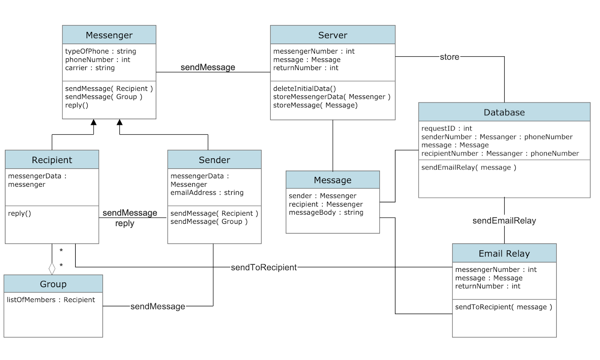

# Analysis

## 1. System Description

It can be difficult for a manager to communicate with all of their employees efficiently and affordably. Lasagna is there to bridge the gap in mass communication. While other apps like TextUs are available, Lasagna improves upon those competitors by making the app affordable and easy to use. With Lasagna, mass communication is made simple and affordable for businesses.

Lasagna allows its ***users*** to send a ***message*** to a group of recipients or an individual **recipient**. The **sender** is able to send a ***message*** through Lasagna’s ***messenger*** app, which then sends the ***message*** to Lasagna’s server. From there the server splits the information from the app and puts the ***message*** request into a **database**, containing the request’s *id, return number, recipient number(s),* and the ***message*** to be sent. Once the request is stored in the **database**, the **email relay** will read the data in the **database**, and will send an email to the **recipient**(s), using said data.  After the email is sent, the **recipient**(s) can choose to reply to the email. If the **recipient**(s) chooses to reply back, Lasagna’s **email relay** will take the reply and, using the data from the **database**, send the reply to the original **sender** as a text ***message***.

## 2. Model

### 2.1 Class Diagram:

### 2.2 Clases:
**Message**
**Sender**
**User**
**Group**
**Database**
**Server**
**Email Relay**
**Recipient**
