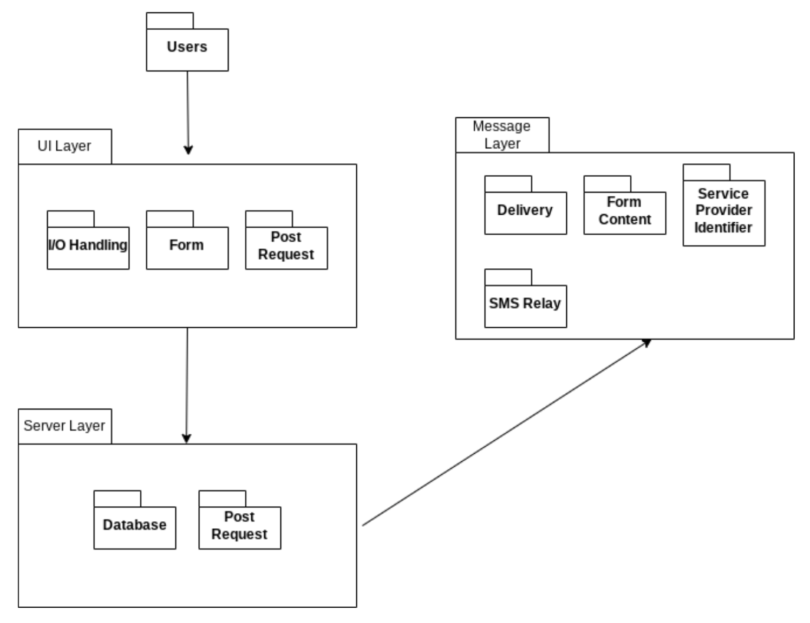
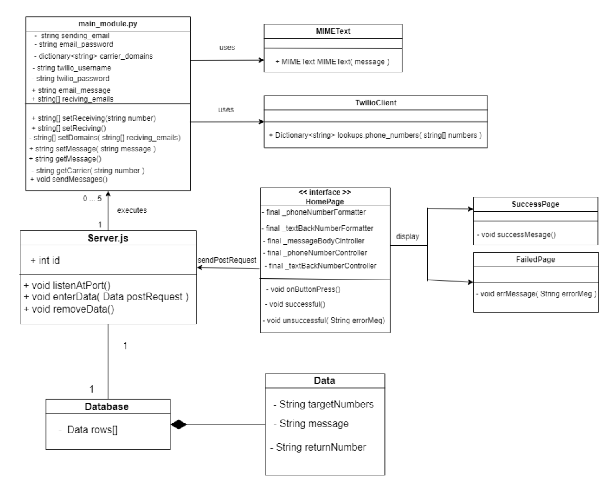
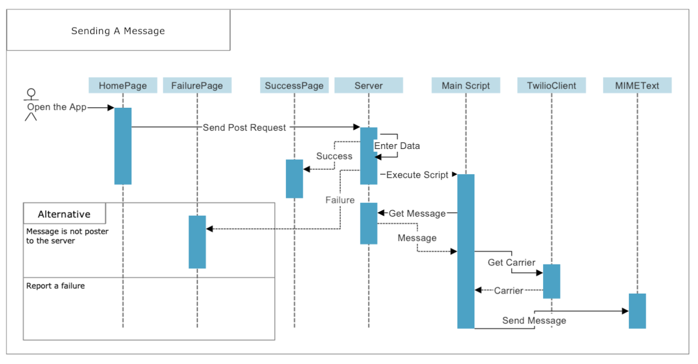
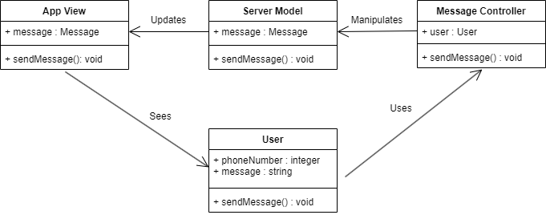
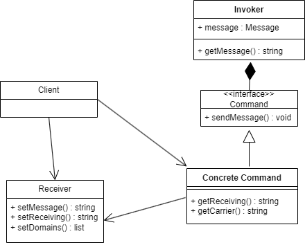

# Design

## 1. Description

Lasagna allows its users to send a message to a group of recipients or an individual recipient. The sender is able to send a message through Lasagna’s messenger app or website, which then sends the message to Lasagna’s server. From there the server splits the information from the app and puts the message request into a database, containing the request’s id, return number, recipient number(s), and the message to be sent. Once the request is stored in the database, the email relay will read the data in the database, and will send an email to the recipient(s), using said data. After the email is sent, the recipient(s) will be provided a way to contact the original sender.

## 2. Architecture

We designed the architecture to be pretty simple. We split the design into three different sections, or layers. We have the UI, Message, and Server layer. The UI layer houses all the content that the user would interact with. This is also where the user would send a post request to the server. The Server layer houses the database. This is where the application would store the data the user is sending. The Message layer holds all the message content including the action of sending the message to the phone number. This architecture is nice and easy to understand, making it easy to implement. 

## 3. Class diagram

The difference between this class diagram and the one that you presented in D.3 is that the last focuses on the conceptual model of the domain while the former reflects the implementation. Therefore, the implementation details are relevant in this case. 

## 4. Sequence diagram

**Use Case:** Sending a message

**Actor:** Lasagna User

**Description:** A Lasagna user sends a message through the app to some phone number

**Preconditions**: The app is open and the user is signed in

**Postconditions**: The message is sent to the entered phone number

**Main Flow**: 
1. The user enters the message that they would like to send
2. The app sends the message to the server
3. The app displays success
4. The server sends the message to the script
5. The script sends the message to the phone number 

**Alternative Flow**: 

- 2a. The app fails to send the message 

- 2b. A failure message is shown

## 5. Design Patterns
**1. Model View Controller**:

Message Controller: https://github.com/nlu6/Lasagna/blob/main/server/main_module.py

Server Model: https://github.com/nlu6/Lasagna/blob/main/server/server.js

App View: https://github.com/nlu6/Lasagna/tree/main/lasagna_app

**2. Command**:

**Invoker**: https://github.com/nlu6/Lasagna/blob/main/server/main_module.py

**Command**: https://github.com/nlu6/Lasagna/blob/main/server/main_module.py

**Concrete Command**: https://github.com/nlu6/Lasagna/blob/main/server/main_module.py

**Receiver**: https://github.com/nlu6/Lasagna/blob/main/server/main_module.py

## 6. Design Principles

**Open/closed principle**: Lasagna takes advantage of this principle by being broken into three different major sections which are broken down into different sections. One example is that the server's core code functionality is separated into different methods, so that more functions can be added to the server, without affecting the core code. Additionally the main module python code that is hosted on another server, has the ability to be added onto without affecting the already defined code.

**Interface segregation principle**: The application/website portion of Lasagna, is broken into many different classes, each for different types of operating systems. Instead of having one big interface that is forced upon each class, each class is formatted into one default style one way or another.
