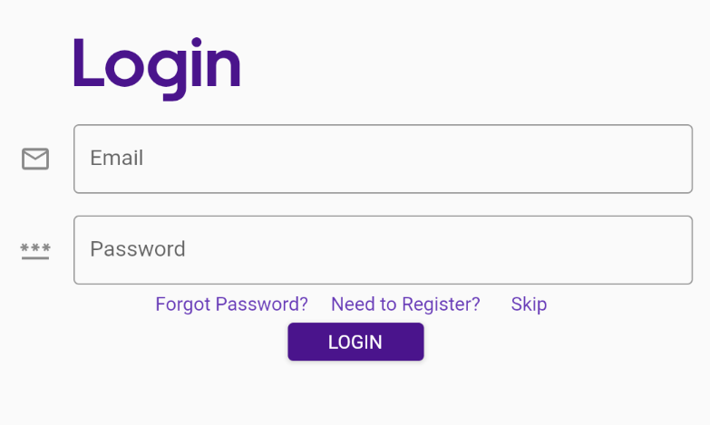
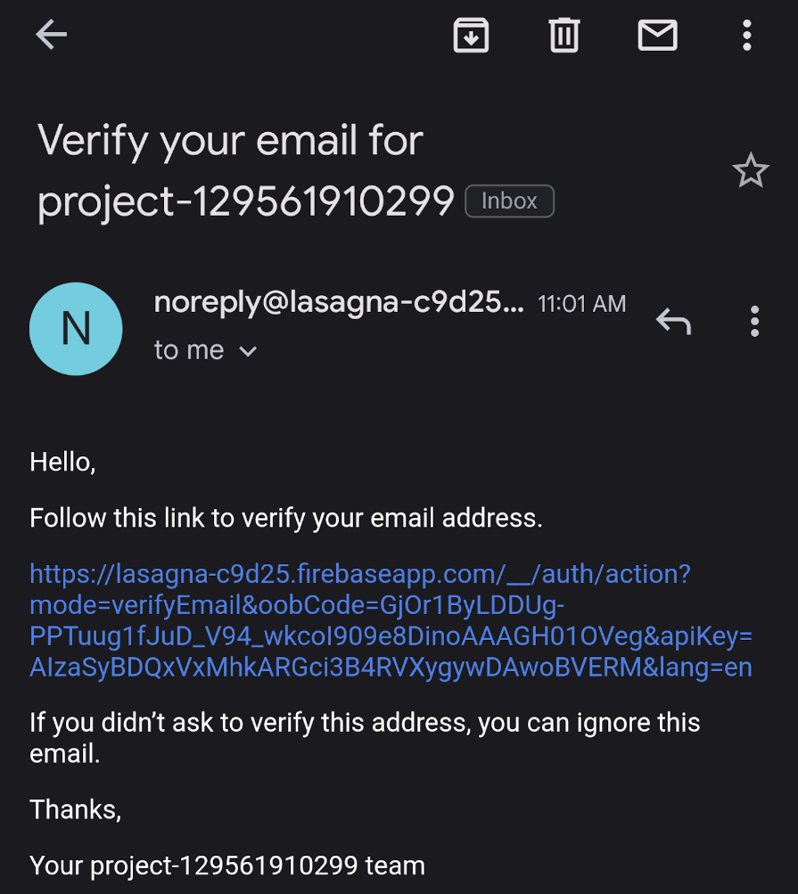

# Implementation 

## 1. Introduction

Lasagna allows its users to send a message to a group of recipients or an individual recipient. The sender is able to send a message through Lasagna’s messenger app or website, which then sends the message to Lasagna’s server. From there the server splits the information from the app and puts the message request into a database, containing the request’s id, return number, recipient number(s), and the message to be sent. Once the request is stored in the database, the email relay will read the data in the database, and will send an email to the recipient(s), using said data. After the email is sent, the recipient(s) will be provided a way to contact the original sender.

[Link to the Project](https://github.com/nlu6/Lasagna)

## 2. Implemented Requirements

### Requirement 1

**Requirement**: As an employee, I want to send a reply, so that I can communicate with my boss.

**Issue**: https://github.com/nlu6/Lasagna/issues/19

**Pull request**: https://github.com/nlu6/Lasagna/pull/23/commits/53d5ca83e1730da9cf304baf48af0d41195cd32b

**Implemented by**: Dylan Franco

**Approved by**: Nathan Underwood

### Requirement 2

**Requirement**: As an user, I want to be able to log-in to use my email as a text back email

**Issue**: https://github.com/nlu6/Lasagna/issues/25

**Pull request**: https://github.com/nlu6/Lasagna/pull/23/commits/4eba02351dc201d3b072638d35ae9534fa923029

**Implemented by**: Aadarsha Bastola

**Approved by**: Niklas Kariniemi

**Print screen**: 

### Requirement 3
**Requirement**: As an user, I want to be able to verify my email in order to use it as a reply back email

**Issue**: https://github.com/nlu6/Lasagna/issues/26

**Pull request**: https://github.com/nlu6/Lasagna/pull/23/commits/82c8e03eb641b3ad2216272c2c03a4d0587933ef

**Implemented by**: Marco Castrita

**Approved by**: Niklas Kariniemi

**Print screen**:

### Requirement 4

**Requirement**: As an employee, I want to be able to access the app on the web if I can’t access my phone at work

**Issue**: https://github.com/nlu6/Lasagna/issues/27

**Pull request**: https://github.com/nlu6/Lasagna/pull/23/commits/2f9c7d47857c9d28910339520dfb388d51f42ae2

**Implemented by**: Aadarsha Bastola

**Approved by**: Nathan Underwood

## 3. Tests

### 3.1.1 Test Framework

For our Sendinblue/Twilio integration, the code is written in Python. As such, we opted to utilize Pytest for our automated testing.

### 3.1.2 Automated Unit Test Links

Automated unit test can be found [here](https://github.com/nlu6/Lasagna/tree/main/server) 

### 3.1.3 Example Test Case

An example of a class being tested can be found in [https://github.com/nlu6/Lasagna/tree/main/server](https://github.com/nlu6/Lasagna/tree/main/server)

### 3.1.4 Result

## 4. Demo

## 5. Code Quality

Code quality was principally maintained by whomever wrote the code. The quality assurance person also reviewed the code during the pull requests. Examples of metrics used to measure code quality are:

- Readability
- Conciseness
- Line limits
- Clear variable names
  
Other team members are also open to suggest changes and improvements to the code to foster better code quality. These suggestions were made via pull requests.

## 6. Lessons Learned

This time around we improved on our communication. We were able to effectively talk with each other to solve problems that would arise with the product. If we were to continue this project, this is something that we would have to maintain. We also improved on scheduling tasks with the proper amount of time. It wasn’t perfect by any means so there is still room for improvement. If we were to continue on the project, giving ourselves more time to complete a task is something that we would have to do.

