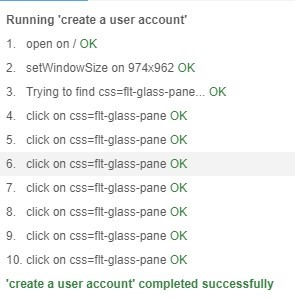
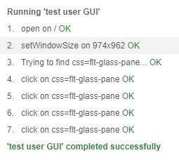

# Verification and Validation

## 1. Description

Lasagna allows its users to send a message to a group of recipients or an individual recipient. The sender is able to send a message through Lasagna’s messenger app or website, which then sends the message to Lasagna’s server. From there the server splits the information from the app and puts the message request into a database, containing the request’s id, return number, recipient number(s), and the message to be sent. Once the request is stored in the database, the email relay will read the data in the database, and will send an email to the recipient(s), using said data. After the email is sent, the recipient(s) will be provided a way to contact the original sender.

[Link to the Project](https://github.com/nlu6/Lasagna)

## 2. Verification

### 2.1 Unit Test

**2.1.1 Test Frameworks**:

For our Sendinblue/Twilio integration, the code is written in Python. As such, we opted to utilize Pytest for our automated testing.

**2.1.2 Link to GitHub folder where tests are located**:

https://github.com/nlu6/Lasagna/tree/main/server 

**2.1.3 An example of a test case that makes use of mock objects**:

None of our source code makes use of object orientation and therefore when testing our script, there are no mock objects. 

**2.1.4 A print screen showing the result of the unit tests execution**:

### 2.2 Acceptance Test

**2.2.1 Test framework you used to develop your tests**:

To test the web version of the app we used the Selenium chrome idle plug-in. After the tests were defined, the tests were executed into javascripts script, so they could be executed outside of the Selenium idle.

**2.2.2 Link to your GitHub folder where your automated acceptance tests are located**:

https://github.com/nlu6/Lasagna/tree/main/server

**2.2.3 An example of an acceptance test**:

https://github.com/nlu6/Lasagna/tree/main/server/testuserGUI.spec.js

This test uses javascript to first set up a selenium website driver. Afterwards, the script creates a driver specifically for chrome, as a test environment, this driver is then used to access the web version of the app. Once the script gets to the website, It takes the actions needed to log in to the website, and to log out of the website. This is done by simulating the actions needed to log-in and out of the website, with the script waiting a little before each action, so the website can load. If all actions can take place without failure the test passes, if not the test fails.

**2.2.4 A print screen/video showing the acceptance test execution**:

## 3. Validation

**Tasks for the user**:

- Open Lasagna and sign in
- Pick a few phone numbers (including your own) to send a message to
- Reply to the message that you sent earlier
- Type in an invalid phone number and attempt to send a message

**Questions to ask the user**:
- What are your impressions of the app?
- How does the UI feel? Is it easy to navigate?
- Does the app feel intuitive to use?
- How does the app match your initial expectations?
- Would you recommend this app to a friend or colleague?
- How would rate the app on a scale of 1 to 10?

### Interview 1

**Name**: Chuck

**Job**: Business Owner

**Summary:**

Found the app was easy to use and was simple. Nothing too complicated going on that could confuse you. Likes the direction that the app is going in, could see himself using this versus a different software he already uses. If he knew someone looking for a cheaper, more simple version of what he uses for his business, he would recommend the app to them.

**Key Insights:**

- UI is clean and easy to use
- Likes the direction that we went with the app
- Would recommend the app
- Gave the app a 8/10

### Interview 2

**Name**: Rick

**Job**: Business Owner

**Summary**:

Likes the overall look of the app, maybe could use a little bit of a wow factor to really impress people. He wants the ability to view the responses to his messages within the app. Thinks the app could use a little bit more features, maybe too simple. If we keep going with the app and adding some more features, then he could see himself recommending the app, so he wouldn’t at this current moment. 

**Key Insights**:
- UI is too simple, could use a wow factor
- Wants to able to view responses to his messages within the app 
- Overall could use some more features to make it more appealing 
- At the moment, he wouldn’t recommend the app 
- Gave the app a 6/10

### Interview 3

**Name**: Amy

**Job**: TA

**Summary**:

She likes the look and feel of the app. Everything is nice and smooth, it seems like a high quality app. She thinks the color scheme of white and purple is very appealing. At first she didn’t realize she was inputting an invalid phone number. She would like the app to tell her that instead of just pretending to send the message. On top of that she thinks it would be a good idea to have a feature where the app displays a message if for whatever reason, the message doesn’t get sent. Doesn’t think there is too huge of a market for this, it's more geared towards a very specific audience, or niche. 

**Key Insights**:

- Feels like a high quality app
- Wants an error message if you input an invalid number or
- Also wants an error message if the message doesn’t get sent, like if the server is working or something like that
- Geared towards a very specific audience
- Could she herself recommending the app if she got more time with it
- Gave the app a 7/10

### Reflections

The feature of sending a message worked very well. People found it easy to use and never got confused on how to send a message. There was some concern that the app didn’t have any wow factor. This isn’t too much of a concern since we want the app to be as simple as possible, don’t want to make it too complicated for no reason. Users didn’t have a problem with creating a log in or sending a message. The only real problem was that there is no way to know if you input an invalid number. So you could be thinking you are sending a message, but nothing is actually happening. We did hit our value proposition, which was to make an easy and affordable app for business folk. The app is easy to use and would be affordable if we added a subscription or a different pricing method. The cost for us to send a message is very cheap and we would not need to charge people too much. 